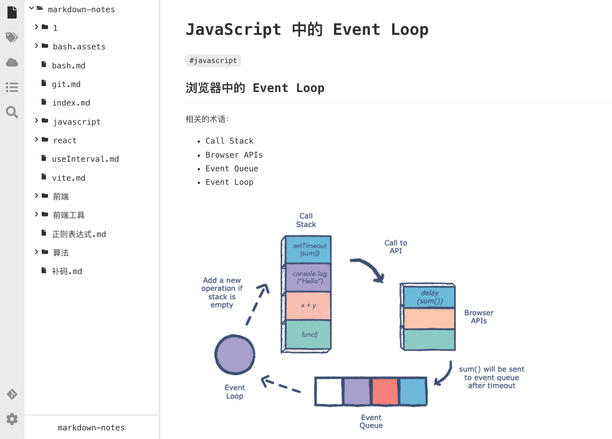
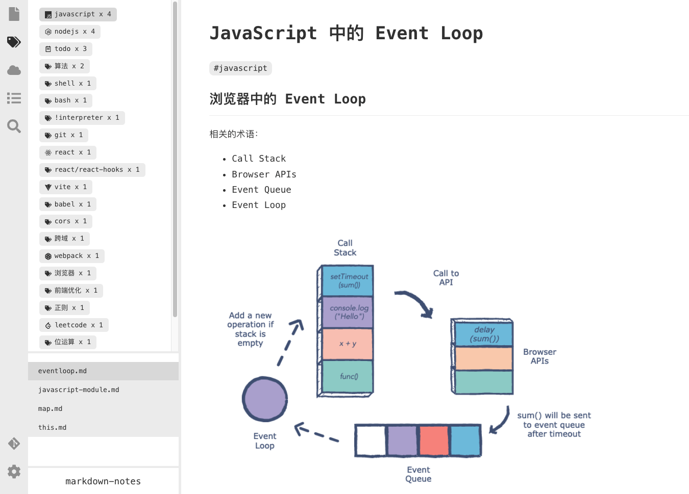
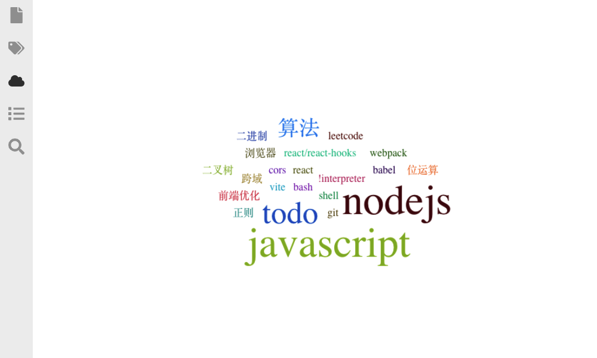

# Knowledge Center

## Introduction

A tool to help you managing your markdown files.

## How To Use

```shell
git clone https://github.com/noiron/knowledge-center.git
cd knowledge-center
yarn install

# for development
npm run dev
# open http://localhost:4000

# use npm link
npm run build
npm link
know # Now, you can use this command in any path (need install ts-node globally)
# open http://localhost:4001
```

## Screenshots

### File Tree



### Tags



### Tag Cloud



## 项目结构

项目使用 vite 创建，代码由两部分组成：

- `server`: node 服务器，用于管理本地的 markdown 文档，给 client 提供接口，使用 Koa 实现
- `src`: client 部分，在浏览器中运行，使用 React 实现

`mds` 文件夹内的文档记录了开发过程中的查阅的资料及技术实现，同时也用于测试本项目的功能。

## 开发目标

- 能通过文件夹和标签两种方式来管理文档
- 能方便地查找文件内容
- 能建立文件间的联系
