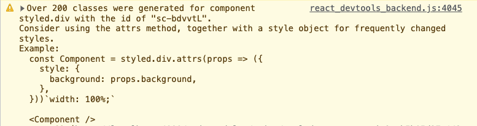
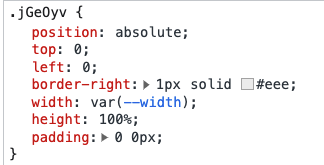

# 开发


## 项目基本结构


## Node.js 的使用

遍历一个文件夹，筛选出特定类型的文件

```javascript
let fileList = fs.readdirSync(filePath);
fileList = fileList.filter((file) => {
  const extname = path.extname(file).toLowerCase();
  return extname === '.md' || extname === '.markdown';
});
```

## 如何使用 markdown-it

## 一个 styled-components 的使用问题（props or css variable）

实现拖动改动左侧边栏的宽度时，用 styled-components 来写了这么个样式组件

```javascript
const StyledFileList = styled.div<{ width: number }>`
  position: absolute;
  top: 0;
  left: 0;
  width: ${props => props.width + 'px'};
  height: 100%;
`;
```

宽度是通过传入的 `width` props 来决定的。但是在没有加入节流（throttle）的状况下，`width` 会变化的非常频繁，会展示如下的错误。



利用开发者工具的查找元素，改变 width 可以看到元素上的 class 名称一直在变化。可以看出 styled-components 给每一个不同的 width 都生成了一个 class。

```html
<div width="270" class="sc-bdvvtL ckAtiw"></div>

<div width="271" class="sc-bdvvtL bBcytR"><div>
```

如果在 html 中搜索相应的 class 名称，如上面的代码中是 `ckAtiw` 和 `bBcytR`，可以在 `<head>` 的 `<style>` 标签中找到它们对应的样式内容，稍加比较就可以发现除了 `width` 以外的部分都是相同的。


> 这里记录下关于 sc 如何生成 class 内容的引用

### 可以使用 css variable 来处理这个问题

对于上面的样式组件，我们可以换一个写法来解决，不再使用 props 来传入，而是使用 css variable。

```typescript
<StyledFileList
  // width={width}
  style={{ '--width': width } as CSSProperties}
>
```

此时再来改变左侧边栏的宽度，可以发现元素的 class 名称是固定的，而 style 是在变化的

```html
<div class="sc-bdvvtL jGeOyv" style="--width:210px;"></div>

<div class="sc-bdvvtL jGeOyv" style="--width:250px;"></div>
```

这样在 `<style>` 标签中相应的样式内容就只会出现一次了。



## 如何使用 Node 来打开 typora

> [Executing Shell Commands with Node.js](https://stackabuse.com/executing-shell-commands-with-node-js/)

`open -a typora` 命令的作用


## 如何处理 drag 来改变区域宽度

> https://stackoverflow.com/questions/26233180/resize-a-div-on-border-drag-and-drop-without-adding-extra-markup


## React 事件中的 `nativeEvent` 是什么

> https://reactjs.org/docs/events.html#overview